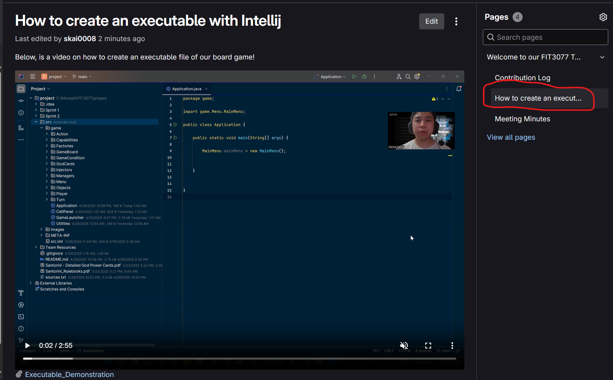

# Project Team 09 Repository

Project Team 09: TITAN GLOBAL TECHNOLOGY\

## Project Team Members:
STEVEN KAING
DYLAN HOANG
TRANG DAI HONG (VIVIAN)
TONY LY


## (WINDOWS) How to create a JAR file and Convert JAR file into an executable.
In the game package, the `game.Application` contains the main constructor method.


DEMONSTRATION VIDEO OF EXECUTABLE  
FOUND IN OUR WIKI PAGE: Creating Executable: [[How to create an executable|Welcome-to-our-FIT3077-Team-09-WIKI-PAGE/How-to-create-an-executable-with-Intellij]]




**Convert runnable file into .jar file:**

1. File -> Project structure -> Artifacts -> Click "+" sign -> JAR -> From modules or dependencies

2. Select the correct module and select the class that has the main method

3. Click OK

4. In the project structure window, change the output directory if needed -> Apply and OK

5. Build -> Build Artifacts -> Click Build

6. DOUBLE CLICK on JAR file and observe.

The JAR file will be sent to the output directory or filepath specified earlier

**Convert .jar into .exe:**
To change the icon of the JAR file, we need an executable wrapper (converting JAR -> exe) and third party software.

1. Install third party software - Launch4j http://launch4j.sourceforge.net/. Instructions on how to launch4j are found below. Then, open Launch4j.

2. Select the output destination of exe file. Output file: name-of-app.exe

3. Select JAR file

4. Add icon (ICO file) (OPTIONAL)

5. Paste in where your JDK is located. Usually, it is located in  C-DRIVE->Program Files->Java 

JRE -> Bundled JRE path: C:\Program Files\Java\jdk-23

6. Select gear icon and give it a name

7. DOUBLE CLICK on .exe file and observe

**How to get .ico file (OPTIONAL)**
1. Go to  https://icoconvert.com/

2. Select an image

3. Upload image

4. Convert to ICO and download .ico

**How to install Launch4j**
1. Visit this link https://launch4j.sourceforge.net/

2. Click Download and should be automatically downloaded.


## (MAC OS) How to create a .app file on MacOS.
Convert runnable file into .jar file:
Same process as on Windows OS.

File → Project structure → Artifacts → Press the + → JAR → From modules or dependencies
Select the correct module and select main class
Can change output directory if wanted → Press Apply and OK
Build Artifacts → Build


Convert .jar into .app:
https://github.com/dante-biase/jar2app

Enter your terminal and type `$ brew install dante-biase/x2x/jar2app`

Change directory to your .jar file and type `$ jar2app JAR_FILE` where `JAR_FILE` is the target file
This will create a runnable `.app`


Notes:

You will run into errors if there are spaces in your working directory of the file. The errors occurs in the runner; Access here ./Contents/MacOS/runner


This can be solved by editing the runner file to the appropriate directory.


## (LINUX) How to create a JAR file and Convert JAR file into an executable.

In the game package, the `game.Application` contains the main constructor method.

1. Go to project folder and Open Command Prompt (cmd.exe). You should be in the project directory

For example: `C:\Monash\FIT3077\project\`

2. READ all java classes into a source.txt file. Compile the java files listed in the source.txt file a
```linux
dir /s /B src\*.java > sources.txt

javac -d out\src @sources.txt
```

3. Copy the images to the `out\src` folder, in a subfolder called images
```linux
xcopy src\images out\src\images /E /I
```

5. For testing purposes, run the Application. Go to the `out` folder and run the `Application`
```linux
java -cp out\src game.Application
```

6. Type in the following command to create JAR. The name of the JAR will be app.jar.
```linux
jar cvfe app.jar game.Application -C out\src .
```

**Convert JAR --> EXE via Launch4j**

1. Install third party software - Launch4j http://launch4j.sourceforge.net/. Instructions on how to launch4j are found below. Then, open Launch4j.

2. Select the output destination of exe file. Output file: name-of-app.exe

3. Select JAR file

4. Add icon (ICO file) (OPTIONAL)

5. Paste in where your JDK is located. Usually, it is located in  C-DRIVE->Program Files->Java 

JRE -> Bundled JRE path: C:\Program Files\Java\jdk-23

6. Select gear icon and give it a name

7. DOUBLE CLICK on .exe file and observe


**How to get .ico file (OPTIONAL)** 
1. Go to  https://icoconvert.com/

2. Select an image

3. Upload image

4. Convert to ICO and download .ico

